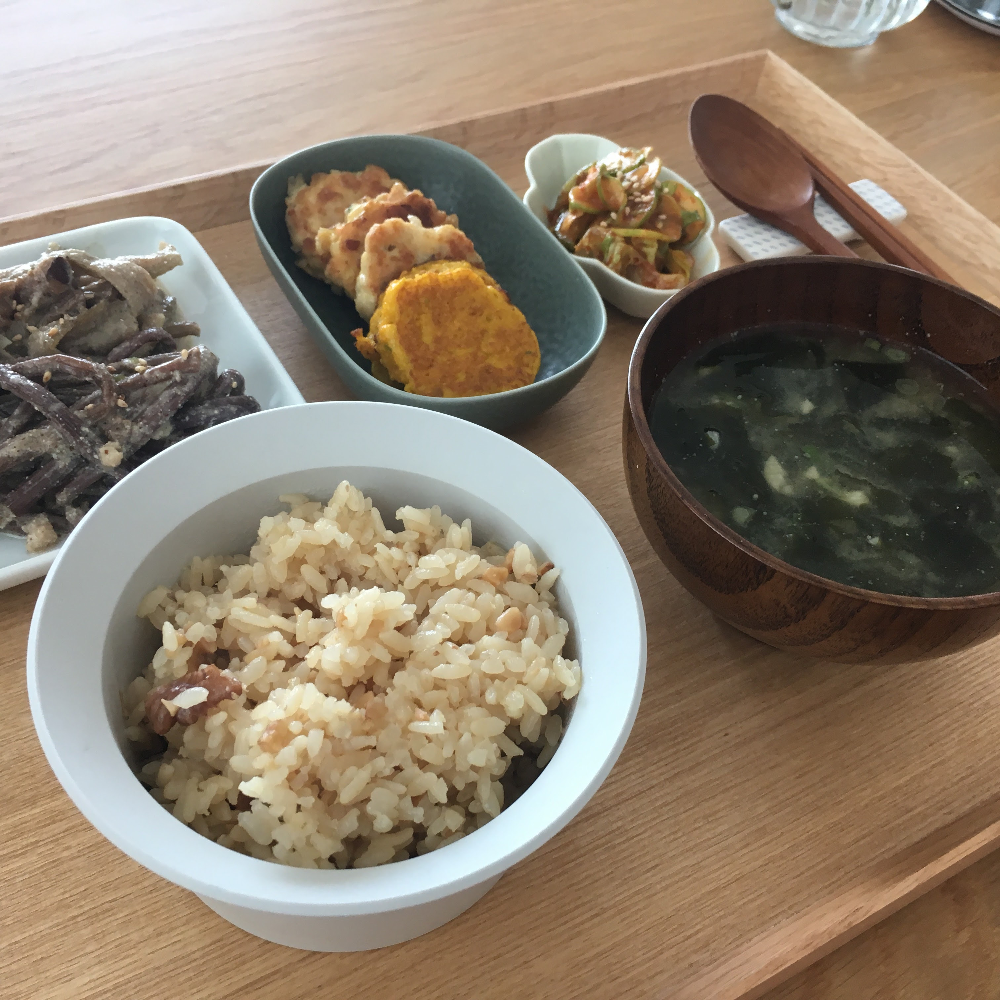

When you have Korean food, the first thing to know is it's not a course meal. Korean meal usually consists of the three things:

- 밥 (pronounced as /bob/, steamed rice)
- 반찬(/banchan/, side dishes)
- 국 or 찌개(/guk/ or /jjigae/, soup)

In Korean restaurants outside Korea, when you order a couple of things, they might serve you a little soup at first as if it's an entrée. You will start having the soup and finish it so that they can serve you the main menu. But, no, it's not like that.

I'm not sure if this is a good comparison, but imagine baguettes when you have meal. You don't have a baguette itself. It goes together with other things. Likewise, you have a spoon of steamed rice and that's not it, but you also have another dishes or soup to help you swallow the rice. On another point of view, the rice is kind of cleansing your mouth so that you can have another dish or soup.

